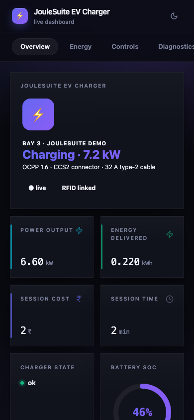
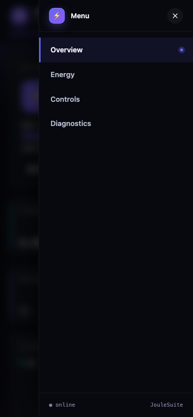

# VectiDash

> Real-time IoT dashboard for ESP32 over a single WebSocket.
> **50 widget types** including donut, joystick, keypad, QR code, heatmap,
> colour picker, custom-HTML escape-hatch. Multi-tab layout, dark / light /
> auto theme, push notifications, anonymous-read mode. Apache-2.0 licensed,
> mobile-first, **46 KB gzipped UI**.


**Author:** [Chinmoy Bhuyan](mailto:chinmoy@joulepoint.com) · **License:** Apache-2.0
· **Targets:** ESP32 (S2 / S3 / C3 / classic)

---

## Features

| | |
|---|---|
| ⚡  **WebSocket transport** | Bi-directional, sub-100 ms updates; no SSE quirks |
| 🎨 **50 widget types** | Every `DashType` renders — 14 readouts, 8 meters, 5 charts, 20 controls, 3 layout. See the **Widget catalogue** below |
| 📑 **Multi-tab layout** | Group cards by `setTab("name")`; pill-style tab bar on tablet/desktop, slide-in hamburger drawer on phones |
| 🌓 **Dark / light / auto theme** | Honors `prefers-color-scheme`; user override persists in `localStorage` |
| 🎨 **Brand colour gradient** | Set with `setBrandColor()` — propagates to buttons, sliders, gauges, charts |
| 🔔 **Notifications from firmware** | `VectiDash.notify(level, msg, ttl)` pushes a toast to every connected tab |
| 🔓 **Optional anonymous-read** | View-only mode without auth; `cmd` frames still require login |
| 🧩 **Custom-HTML widget** | Drop any DOM snippet into a card body and update it from C++ via `setValue()` |
| 📐 **12-column responsive grid** | `setWidth(N)` per card; the grid stays 12 columns and each card's span is widened on narrower viewports |
| 🪶 **46 KB gzipped UI** | Pre-gzipped and served with `Content-Encoding: gzip` — 46,812 bytes on the wire and in flash, 155,079 bytes after the browser inflates it |
| 📱 **Touch-first** | 44 px touch targets, swipe-scrollable tabs, joystick with pointer-capture |

---

## Quick start

```cpp
#include <WiFi.h>
#include <ESPAsyncWebServer.h>
#include <VectiDash.h>

AsyncWebServer server(80);
vecti::DashCard temp (vecti::DashType::Number, "t",  "Temperature", "°C");
vecti::DashCard led  (vecti::DashType::Switch, "l",  "Onboard LED");

void setup() {
  WiFi.begin("YOUR_SSID","YOUR_PASS");
  while (WiFi.status()!=WL_CONNECTED) delay(200);

  pinMode(LED_BUILTIN,OUTPUT);
  led.onChange([](const String &v){ digitalWrite(LED_BUILTIN, v=="1"); });

  VectiDash.add(&temp);
  VectiDash.add(&led);
  VectiDash.begin(&server);          //  /, /dash, /dash/ws
  server.begin();
}

void loop() {
  static uint32_t t=0;
  if (millis()-t > 1000) { t=millis(); temp.setValue(readSensor()); }
  VectiDash.tick();                  // pushes dirty cards (≤10 Hz default)
}
```

Open `http://<device-ip>/` — done.

---

## Widget catalogue

Every widget is declared as a `DashCard` and exposed via the same
`add()` → `setValue()` → optional `onChange()` flow.

All 50 `DashType` enumerators render in the bundled UI. The **Wire** column is
the string `describe()` puts in the layout frame — useful if you replace the
bundle with your own front-end. Widgets marked **→** send `onChange`.

### Readouts (14)

| Type | Wire | Value you `setValue()` | Renders as |
|---|---|---|---|
| `Number` | `number` | any number | Large numeric value + unit suffix |
| `Text` | `text` | any string | Single-line text, `—` when empty |
| `Status` | `status` | free text | Coloured pill; auto-classifies `ok/online/connected` → green, `warn` → amber, `err/off/fail` → red |
| `Badge` | `badge` | any string | Compact pill tinted by `setColor()` |
| `Led` | `led` | `1`/`true`/`on`, `blink`, anything else | Lamp with ON / BLINK / OFF caption |
| `Temperature` | `temperature` | any number | Number card with a thermometer-y label tint |
| `Humidity` | `humidity` | any number | Number card with a humidity-y label tint |
| `Battery` | `battery` | number in `setRange()`; trailing `+` (or `setUnit("charging")`) marks charging | Battery pictogram, red below 20 % |
| `Signal` | `signal` | RSSI in dBm | 4-bar strength meter (≥ −55/−65/−75/−85 dBm) |
| `Uptime` | `uptime` | seconds | `3d 04h` style two-unit duration |
| `Table` | `table` | `k=v;k=v` or a JSON array of `[key,value]` | Two-column key/value list |
| `LogView` | `logview` | newline-separated lines, or a JSON array of strings | Scrolling log pane, auto-sticks to the bottom |
| `Image` | `image` | `data:` URI or `https://…` | `` rendered inline |
| `Sparkline` | `sparkline` | comma-separated numbers, or a JSON array | Mini trend line + latest value and point count |

### Meters (8)

All eight read `setRange(lo, hi)`.

| Type | Wire | Renders as |
|---|---|---|
| `Gauge` | `gauge` | Half-circle SVG arc, gradient stroke |
| `Dial` | `dial` | 270° dial with needle and min/max ticks |
| `Donut` | `donut` | Full SVG ring, centred readout |
| `Progress` | `progress` | Brand-gradient bar with glow |
| `Bar` | `bar` | Horizontal bar; `setStep()` inside the range draws a threshold marker and a "threshold reached" caption |
| `Level` | `level` | Vertical tank fill; amber ≤ 25 %, red ≤ 10 % |
| `Compass` | `compass` | Rotating needle + 16-point cardinal label (value in degrees) |
| `Thermo` | `thermo` | Thermometer column with tick marks |

### Charts (5)

| Type | Wire | Value you `setValue()` | Renders as |
|---|---|---|---|
| `Chart` | `chart` | use `chartPushXY()` / `chartSetSeries()` | Line/area chart, gridlines + last-point dot. **Needs ≥ 2 points** |
| `MultiChart` | `multichart` | `{"s":[{"n":"L1","y":[…]},…],"x":[…]}` — up to 5 series, `x` optional | Overlaid lines, one dash pattern per series |
| `Histogram` | `histogram` | `{"v":[…],"l":[…]}` — up to 24 bars, `l` labels optional | Bar chart with a zero baseline |
| `Scatter` | `scatter` | `{"x":[…],"y":[…]}` — up to 400 points | Auto-scaled dot plot |
| `Heatmap` | `heatmap` | `{"v":[…],"w":<cols>}` — up to 2048 cells, ≤ 64 columns | Row-major coloured grid |

### Controls (20)

| Type | Wire | → payload | Renders as |
|---|---|---|---|
| `Button` | `button` | `"1"` | Click → callback + a brief glow |
| `ConfirmButton` | `confirm` | `"1"` | Two-stage: first click arms a countdown, second confirms |
| `Momentary` | `momentary` | `"1"` on press, `"0"` on release | Hold-to-run pad with pointer capture |
| `Switch` | `switch` | `"1"` / `"0"` | Toggle; click or Space/Enter |
| `Slider` | `slider` | number | Range slider with live value bubble |
| `RangeSlider` | `range` | `"lo,hi"` | Two-thumb range; value in is `"lo,hi"` too |
| `Stepper` | `stepper` | number | −/+ buttons stepping by `setStep()` within `setRange()` |
| `Dropdown` | `dropdown` | the chosen option | `<select>` filled from `setOptions("A\|B\|C")` |
| `Radio` | `radio` | the chosen option | Segmented control from `setOptions()` |
| `Checklist` | `checklist` | pipe-joined selection, e.g. `"Eco\|Boost"` | Checkboxes from `setOptions()`; value in is the same pipe-joined form |
| `Input` | `input` | the text | Text input; fires on Enter/blur |
| `Textarea` | `textarea` | the text | Multi-line; sends on blur or Ctrl/⌘+Enter, shows an unsaved dot |
| `Password` | `password` | the text | Masked input with a reveal toggle |
| `Keypad` | `keypad` | the entered digits | 0–9 numeric pad, backspace/clear, keyboard-driveable |
| `Joystick` | `joystick` | `"x,y"` in [−100, 100] | Round pad, drag with pointer capture |
| `XYPad` | `xypad` | `"x,y"` in [0, 100] | Square pad, drag or arrow keys |
| `Knob` | `knob` | number | Rotary knob over `setRange()` / `setStep()` |
| `Color` | `color` | `#rrggbb` | Native colour picker + hex readout |
| `DateTime` | `datetime` | Unix seconds | `datetime-local` input; value in is Unix seconds too |
| `QrCode` | `qrcode` | the text to encode | QR rendered on-device in the browser (no network) |

### Layout & escape hatch (3)

| Type | Wire | Renders as |
|---|---|---|
| `Header` | `header` | Full-width section heading (`label`, with `unit` as sub-text) |
| `Divider` | `divider` | Full-width rule, optionally captioned with `label` |
| `Custom` | `custom` | Arbitrary HTML via `setCustomHtml()`. See **Custom widget** below |

---

## API reference

### `DashCardBase`

```cpp
DashCardBase(DashType t, const String &id, const String &label);
DashCardBase(DashType t, const String &id, const String &label, const String &unit);
DashCardBase(DashType t, const String &id, const String &label, const String &unit, float lo, float hi);
```

#### Layout

```cpp
void setLabel (const String &s);
void setUnit  (const String &s);
void setColor (DashColor c);              // Default / Success / Warning / Danger / Info / Primary
void setTab   (const String &t);
void setHidden(bool h);
void setWidth (uint8_t cols);             // 1..12 in the grid; 0 = auto
```

#### Value setters (overloaded)

```cpp
void setValue(int);          // also unsigned, long
void setValue(float, int digits = 2);
void setValue(double, int digits = 2);
void setValue(bool);                       // "1" or "0"
void setValue(const char *);
void setValue(const String&);
```

#### Range (slider / gauge / progress / donut / number)

```cpp
void setRange(float lo, float hi);
void setStep (float step);
```

#### Choices (dropdown / radio / checklist)

```cpp
void   setOptions(const String &pipeSeparated);   // "Eco|Standard|Boost"
String options() const;
```

Pipe-separated, matching VectiNet's parameter convention. A `Checklist`
reports its selection back the same way (`"Eco|Boost"`). The list rides in the
layout frame as `opts`, so call `setOptions()` before `add()` or follow it with
`refreshLayout()`.

#### Chart helpers

```cpp
void chartPushXY (float x, float y);                    // rolling buffer
void chartSetSeries(const float *xs, const float *ys, size_t n);  // keeps the newest maxPoints
void chartSetMaxPoints(size_t n);                       // default 50
void chartSetType(ChartType t);                         // Line | Bar | Area
```

The bundled UI plots against your x values — pushing on an irregular cadence
draws with the right horizontal spacing, no fixed sample interval needed. It
needs **two** points before it draws anything; a chart with one sample in it
stays blank. One caveat: it draws the same gradient area+line for all three
`ChartType`s.
The type is still carried in the layout frame for front-ends that replace it.

#### Custom widget

```cpp
void setCustomHtml(const String &html);
```

Set an HTML snippet to render inside the card body. If the snippet
includes `<span id="dash-<cardId>-out"></span>`, the runtime injects the
card's `setValue()` text into that span on every broadcast.

That span is the whole contract. The snippet is injected as markup, so a
`<script>` inside it never executes — anything more interactive means
replacing the UI bundle.

#### Callback

```cpp
using DashChangeCb = std::function<void(const String &payload)>;
void onChange(DashChangeCb cb);
```

Fires when a user interacts with this widget (button click, switch
toggle, slider drag, joystick move, colour pick, input change). The
`payload` is the new value as a string.

**The callback runs on the `loop()` task, from inside `tick()`.** The
WebSocket task queues the frame and returns immediately, so a slow callback
cannot stall the server's other sockets — but it does stall your `loop()`,
and the interaction lands up to one push interval (default 100 ms) after
the tap. Anything genuinely long — a flash write, a synchronous HTTP fetch,
a reboot — still belongs behind a flag, not inside the callback.

This also means card values are only ever touched from one task, so
`setValue()` from `loop()` never races the socket.

### `VectiDashClass`

```cpp
void begin(AsyncWebServer *server,
           const String &username = "",
           const String &password = "",
           bool allowAnonymousRead = false);

void add(DashCardBase *card);              // register a card (raw pointer; outlive VectiDash)
void refreshLayout();                       // force a re-push of layout to all clients
void tick();                                // call from loop(); coalesced push of dirty cards

void addTab(const String &name);

void setTitle              (const String &t);
void setBrandColor         (const String &cssColor);
void setTheme              (const String &t);          // "dark" / "light" / "auto"
void setMinPushIntervalMs  (uint32_t ms);              // default 100 → ≤10 Hz

void notify(NotifyLevel lvl, const String &msg, uint32_t ttlMs = 5000);
```

`NotifyLevel`: `Info` · `Success` · `Warn` · `Error`.

---

## HTTP & WebSocket protocol

### HTTP

| Path | Description |
|---|---|
| `/`          | 302 → `/dash` |
| `/dash`      | The dashboard SPA |
| `/dash/login`| Challenges for credentials, sets the write ticket, 302 → `/dash` |
| `/dash/ws`   | WebSocket endpoint (upgrade required; write authority decided here) |

### WebSocket frames (JSON, one per text frame)

**Server → client:**

```jsonc
// On connect (and on refreshLayout()):
{
  "type":  "layout",
  "title": "VectiSuite Dashboard",
  "brand": "#7c5cff",
  "theme": "auto",
  "tabs":  ["Overview","Controls","Charts"],
  "cards": [
    { "id":"t",  "type":"temperature", "label":"Temp",
      "unit":"°C", "color":"info", "tab":"Overview",
      "min":0, "max":100, "step":1, "width":3,
      "hidden":false, "chartType":"line", "value":"" },
    …
  ]
}

// Value update batch:
{
  "type":  "upd",
  "cards": [ {"id":"t","value":"22.4"}, {"id":"led","value":"1"}, … ]
}

// Toast:
{ "type":"notify", "level":"success", "message":"Update applied", "ttl":5000 }
```

**Client → server:**

```jsonc
{ "type":"cmd",   "id":"led", "value":"1" }   // user interaction
{ "type":"hello" }                            // request fresh layout
```

When the server receives a `cmd` it:

1. Checks that the socket is allowed to write (see **Anonymous read,
   authenticated write** below); ignores the frame if not
2. Queues it (the WebSocket task does nothing else with it)
3. On the next `tick()`, updates the card's stored value and calls the
   card's `onChange()` callback (host C++ does work here)
4. Leaves the card dirty, so that same `tick()` **re-broadcasts** it to
   every connected tab

Step 4 broadcasts whatever the callback left behind, not what was
requested — a callback that clamps or rejects the value corrects every
tab, including the one that sent it.

---

## UI walkthrough

| Region | Contents |
|---|---|
| Header | App icon · title · live status pill · theme toggle (◐) |
| Tab bar | Horizontally-scrolling, brand-gradient highlight on active |
| Grid | 12-column responsive grid; cards have glass-morphism, hover lift, branded accents per `DashColor` |
| Toast stack | Bottom-right; auto-dismiss after `ttl`; colour-coded by level |

Mobile (390 px wide):

| Phone — Overview tab | Phone — Hamburger drawer |
|---|---|
|  |  |
| KPI cards collapse to 2-up pairs, sparkline + Lucide icon stay legible, hero card stacks vertically with brand-gradient title. | Tap the `☰` icon in the header (right side) and the tab list slides in from the right. Active tab gets a brand accent strip + pulse dot. Dismiss via the `X`, a backdrop tap, or ESC. |

Responsiveness is done in JS off `window.innerWidth`, not with CSS media
queries: the viewport is classified **`small` ≤ 448 px**, **`tablet` ≤ 800 px**,
**`desktop`** above that. The container is always a 12-column grid — what
changes is each card's `grid-column` span, so a `setWidth(3)` card widens on
tablet and goes full-width on a phone. At `small` the horizontal tab bar is
replaced by the slide-in drawer, so a narrow viewport never has tabs hidden
off-screen. (The only `@media` rules in the bundle are
`prefers-color-scheme` and `prefers-reduced-motion`.)

---

## Patterns

### React to a slider

```cpp
vecti::DashCard bright(vecti::DashType::Slider, "b", "Brightness", "%");
bright.setRange(0, 255);

void setup() {
  bright.onChange([](const String &v){
    ledcWrite(0, v.toInt());        // PWM on LEDC channel 0
  });
  VectiDash.add(&bright);
}
```

### React to a button

`onChange` runs inside `tick()`, so anything that blocks for longer than a
push interval still goes in `loop()` behind a flag:

```cpp
vecti::DashCard reboot(vecti::DashType::Button, "rb", "Reboot");
volatile uint32_t rebootAt = 0;

reboot.setColor(vecti::DashColor::Danger);
reboot.onChange([](const String &){
  VectiDash.notify(vecti::NotifyLevel::Warn, "Rebooting in 1s", 1000);
  rebootAt = millis() + 1000;              // never delay() in here
});

void loop() {
  VectiDash.tick();
  if (rebootAt && (int32_t)(millis() - rebootAt) >= 0) ESP.restart();
}
```

### Push a notification from firmware

```cpp
VectiDash.notify(vecti::NotifyLevel::Success,
                 String("MQTT connected to ") + brokerHost, 4000);
```

### Plot a time-series

```cpp
vecti::DashCard tempChart(vecti::DashType::Chart, "tc", "Temperature");
tempChart.setWidth(12);
tempChart.chartSetType(vecti::ChartType::Area);
tempChart.chartSetMaxPoints(120);

void loop() {
  if (timeForNewSample()) tempChart.chartPushXY(millis()/1000.0f, readTemp());
  VectiDash.tick();
}
```

### Custom HTML widget — embed a graph, gauge, or anything

```cpp
vecti::DashCard custom(vecti::DashType::Custom, "cus", "Charger state");
custom.setWidth(12);
custom.setCustomHtml(R"(
  <div style='display:flex;gap:18px;align-items:center'>
    <div style='font-size:34px'>⚡</div>
    <div>
      <div style='font-size:11px;color:var(--muted)'>Current draw</div>
      <div style='font-family:monospace'>last tick: <span id='dash-cus-out'>—</span></div>
    </div>
  </div>
)");

void loop() {
  custom.setValue(String(currentA(), 1) + " A");   // updates #dash-cus-out
  VectiDash.tick();
}
```

The `#dash-<id>-out` span is the only hook. A `<script>` block inside
`setCustomHtml` is injected as markup and never runs.

### Anonymous read, authenticated write

```cpp
VectiDash.begin(&server, "admin", "vecti", /*allowAnonymousRead=*/true);
```

Anyone can view the dashboard; only authenticated tabs can send `cmd`
frames. Useful for shop-floor displays. With `allowAnonymousRead=false`
(the default) the page, the redirect and the WebSocket upgrade all
require credentials.

How the socket knows: browsers do not attach Basic credentials to a
WebSocket handshake, so an authenticated page GET sets a per-boot ticket
cookie (`jdash`, `HttpOnly`, `SameSite=Strict`) and the upgrade presents
it. Non-browser clients may send Basic on the upgrade instead.

In anonymous-read mode nothing challenges by itself — send the operator
to **`http://<device-ip>/dash/login`**, which prompts for credentials,
sets the ticket and bounces back to the dashboard. Until they do, their
`cmd` frames are dropped. Two more consequences worth knowing:

* The ticket is regenerated on every reboot — a tab left open across a
  restart reconnects with a stale ticket and needs a reload.
* The ticket is as plaintext as the Basic password it stands in for.
  This is LAN-grade auth, not internet-grade; put the device behind TLS
  or a VPN if the network is not trusted.

### Multi-tab layout

```cpp
VectiDash.addTab("Overview");
VectiDash.addTab("Controls");
VectiDash.addTab("Charts");

cTemp .setTab("Overview");
cLed  .setTab("Controls");
cChart.setTab("Charts");
```

---

## Theme + brand colour

* **Auto** (default) honours the user's OS preference.
* **Brand colour** is a single hex (`setBrandColor("#7c5cff")`) that
  drives gradients on buttons, sliders, gauges, chart lines, donut
  strokes, focus rings and selected tabs.
* The user can override via the ◐ icon in the header; the choice
  persists per browser in `localStorage["vecti-theme"]` (`"auto"`, `"light"`
  or `"dark"`).

---

## Update cadence

`VectiDash.tick()` coalesces dirty cards into a single push at most every
`setMinPushIntervalMs(100)` ms (default 10 Hz). Increase the throttle
for high-frequency telemetry (`setMinPushIntervalMs(40)` for 25 Hz) or
relax it on weak Wi-Fi (`setMinPushIntervalMs(500)`).

The push is **delta-only** — only cards whose `setValue()` produced an
actual change since the last tick are included.

A tick is skipped entirely while **any** client's send queue is full, so a
phone on a bad link makes everyone's updates coalesce for a moment instead
of silently losing them. That check is all-or-nothing by design, and the
price is head-of-line blocking: one backgrounded tab with a stuffed queue
pauses updates for every other viewer until it is reaped. `tick()` reaps
dead sockets on every pass, which is what bounds that stall (and what keeps
the client cap meaningful).

`tick()` is also where inbound `cmd` frames are applied and `onChange`
callbacks run — see the callback note above.

---

## Troubleshooting

| Symptom | Cause | Fix |
|---|---|---|
| WebSocket connects then disconnects every few seconds | Page tab is in the background and the browser throttles WS | Use `notify()` for important state; the UI will reconcile on focus |
| Layout doesn't show new cards I `add()`-ed at runtime | Layout is cached on the client | Call `VectiDash.refreshLayout()` |
| Slider value snaps back to the old value when I drag | Two clients fighting over the value, or an `onChange` that clamps it | Last cmd wins, and a clamping callback wins over that. Coordinate via your own state machine |
| `Chart` widget is blank | Fewer than two points pushed — the renderer bails before it draws | Push at least **two** points |
| A `Dropdown` / `Radio` / `Checklist` shows "no options" | `setOptions()` ran after the layout frame went out | Call it before `add()`, or follow it with `refreshLayout()` |
| `Custom` widget value not updating | No `<span id="dash-<id>-out">` in the HTML | Add one — it is the only injection point |
| WebSocket never connects after enabling auth | Tab was loaded before the last reboot, so its ticket cookie is stale | Reload the page |

---

## Dependencies

* `ESP32Async/ESPAsyncWebServer @ ^3.7.0`
* `ESP32Async/AsyncTCP @ ^3.4.10`
* `bblanchon/ArduinoJson @ ^7.4.0`

Either arduino-esp32 core works — `AsyncURIMatcher::exact()` comes from
ESPAsyncWebServer ≥ 3.7, not from the core. This repo's demo builds on
platform espressif32 6.13.0 (= arduino-esp32 2.0.17).

ESP32 only. AsyncTCP is an ESP32 library and `AsyncURIMatcher` exists
only in the ESP32Async 3.x fork, so there is no ESP8266 build.

---

## License

Apache-2.0 — see [LICENSE](LICENSE).

---

<sub>**Author:** Chinmoy Bhuyan · **Email:** chinmoy@joulepoint.com · **(c)** 2026 — Apache-2.0</sub>
